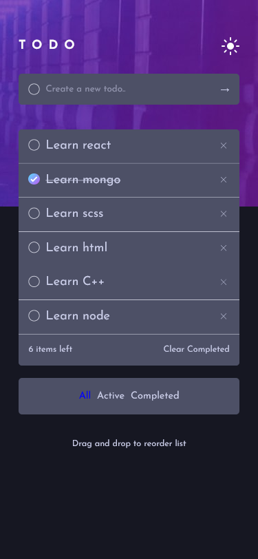

# Frontend Mentor - Todo app solution

This is a solution to the [Todo app challenge on Frontend Mentor](https://www.frontendmentor.io/challenges/todo-app-Su1_KokOW).

## Table of contents

- [Overview](#overview)
  - [The challenge](#the-challenge)
  - [Screenshot](#screenshot)
  - [Links](#links)
- [My process](#my-process)
  - [Built with](#built-with)
  - [What I learned](#what-i-learned)
  - [Continued development](#continued-development)
  - [Useful resources](#useful-resources)
- [Author](#author)

## Overview

### The challenge

Users should be able to:

- View the optimal layout for the app depending on their device's screen size
- See hover states for all interactive elements on the page
- Add new todos to the list
- Mark todos as complete
- Delete todos from the list
- Filter by all/active/complete todos
- Clear all completed todos
- Toggle light and dark mode
- Drag and drop to reorder items on the list

### Screenshot

### Links

- Solution URL: [Github](https://github.com/ceesiyamoah/to-do)
- Live Site URL: [Live](https://ccyamoah-todo.netlify.app)

## My process

### Built with

- CSS custom properties
- Flexbox
- Mobile-first workflow
- [React](https://reactjs.org/) - JS library

### What I learned

- React Custom Hooks
- Drag and Drop API
- Context API
- Using SVG in react
- matchMedia

### Continued development

- Other hooks in react
- Responsive design in react
- Context

### Useful resources

- [MDN](https://developer.mozilla.org/)
- [Example resource 2](https://www.example.com) - This is an amazing article which helped me finally understand XYZ. I'd recommend it to anyone still learning this concept.

**Note: Delete this note and replace the list above with resources that helped you during the challenge. These could come in handy for anyone viewing your solution or for yourself when you look back on this project in the future.**

## Author

- Website - [Cyril Yamoah](https://https://cyrilyamoah.netlify.app/)
- Frontend Mentor - [@ceesiyamoah](https://www.frontendmentor.io/profile/@ceesiyamoah)
- Twitter - [@Siisi_Any](https://www.twitter.com/Siisi_Any)
